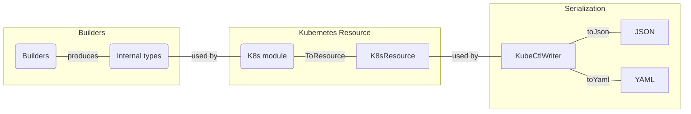

# Starboard test strategy

The test strategy tries to follow the ABC method. Since this is a library, not all sections are as relevant.

## Acceptance tests

*./tests/Starboard.Acceptance.Tests*

The acceptance criteria is that the generated JSON or YAML matches the Kubernetes specification. It does this by verifying that the type produced matches the Kubernetes specification.

So in the above illustration, Acceptance tests know about the Builders, which is the API used by consumers of the library, and the `K8sResource`. The `K8sResource` is a type that matches the Kubernetes resource specification, and can so be serialized directly to JSON or YAML that can be POSTed to a Kubernetes cluster.

Questions:

- Are resources listed as expected?
- Does the workflow product the expected resource with correct values?
- Does invalid builder usage produce validation errors?

### Guidelines

- Each component/component should have its own suite of tests
- Each top level property for a component MUST have at least 1 test verifying the structure (via the compiler) and that values are set as expected
- Each top level property for a component SHOULD have at least 1 test verifying validation rules
- Acceptance tests MUST **HAVE ZERO KNOWLEDGE** of the internal types used by the *builders*
- Developers SHOULD abstract away construction of builders if used in the same way across multiple tests

## Building tests

*./tests/Starboard.Building.Tests*

Builder tests are those tests that know about the internal structure of your application/library. Practices like TDD are great for giving a feeling of progress but lead to a test suite where tests are tied deeply to the internals of the codebase. This can often have the unintended side-effect of making the codebase more difficult to change (the opposite of what good test coverage should give). This can be mitigated by thoughtfully differentiating between Acceptance & Building type tests. By restricting tests that know about the internals of the codebase to a grouping of tests, we are free to delete those tests if they impose too high a cost on changes to the codebase. This comes with a caveat... Acceptance tests need to cover the major parts of important behaviour we care about. This approach acknowledges that verify behaviour is important but sometimes tests that have deep structural knowledge add value while creating the system under test but come at a cost later.

Examples:

- Details about serialization
- Logic on how validations interact

### Guidelines

- Create as needed and follow usual unit testing good sense
- Please don't use a mocking framework
- You MUST have acceptance tests that cover the same SUT, even if indirectly
- You SHOULD delete Builder tests if the implementation changes and they are getting in the way

## Communication tests

*./tests/Starboard.Communication.Tests*

Communication tests typical verify connection and shared language (read schema/syntax) between running applications. Examples here are health endpoints checking dependencies as well as contract tests.
Since this is a library, this is NOT a group of tests that is too important. In the future communicating with Kubernetes directly may be in scope. Another option here is to verify schema by comparing known JSON/YAML with generated files.

What we will classify under communication tests is the taking of a type that is verified (by Acceptance tests) as valid Kubernetes schema and serialize to valid JSON or YAML.

Questions:

- Does the serializer handle lists, numbers, null, etc. as expected?
- Do my JSON and YAML match?